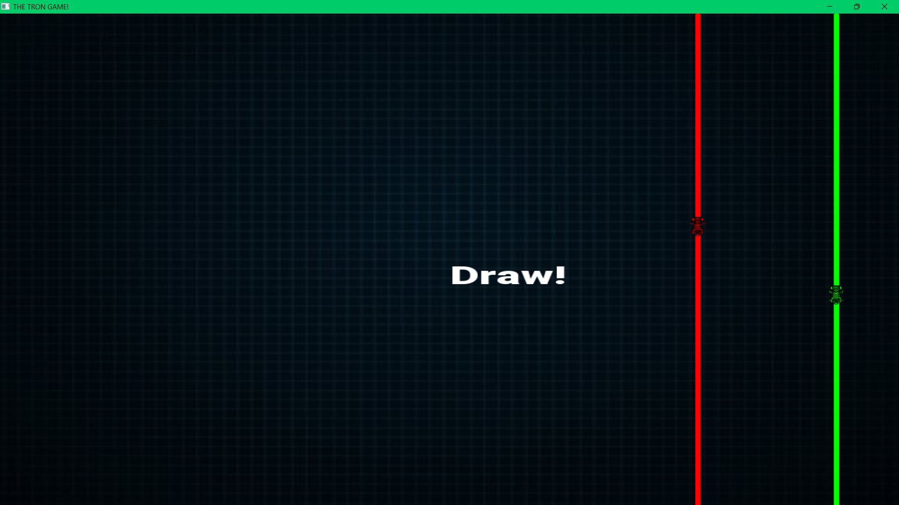

---
## Tron Game

### Description
This Tron game is developed using the SFML library in C++. It is a two-player game where players control their bikes and try to avoid crashing into the trails left by themselves and their opponent. The game features smooth graphics and dynamic gameplay, making it an engaging experience for both players.

### How to Run
1. **Clone the Repository**:
   - Clone this repository to your local machine using the following command:
     ```bash
     git clone https://github.com/P1Manav/TRON_GAME.git
     ```
2. **Setup Visual Studio**:
   - Make sure you have Visual Studio installed. You can download it from [here](https://visualstudio.microsoft.com/downloads/).
   - Open Visual Studio and Clone a new repository direct or open the .sin file from the project directory.

3. **Open the Project**:
   - Open the `.sln` file in Visual Studio to load the project.

4. **Run the Project**:
   - Set the configuration to `x86`.
   - Build the project by clicking on `Build` > `Build Solution` or pressing `Ctrl+Shift+B`.

5. **Run the Game**:
   - Run the game by clicking on `Debug` > `Start Without Debugging` or pressing `Ctrl+F5`.

### How to Play
- **Player Controls**:
  - Player 1 (Green): Use the `W`, `A`, `S`, `D` keys to move up, left, down, and right respectively.
  - Player 2 (Red): Use the arrow keys (`↑`, `←`, `↓`, `→`) to move up, left, down, and right respectively.

- **Objective**:
  - The objective of the game is to avoid crashing into your own trail or your opponent's trail as the w. The player who survives the longest wins the game. If both players crash simultaneously, the game ends in a draw.
  - The walls in this game function like those in Pac-Man. This means that when a player moves off one edge of the screen, they reappear on the opposite side. Use this to your advantage to outmaneuver your opponent.


- **Winning the Game**:
  - If one player crashes while the other survives, the surviving player is declared the winner. The game will display the winner on the screen.

### Screenshots


---
<p align="center">
  
</p>
<p align="center">
  
</p>
<p align="center">
  
</p>
